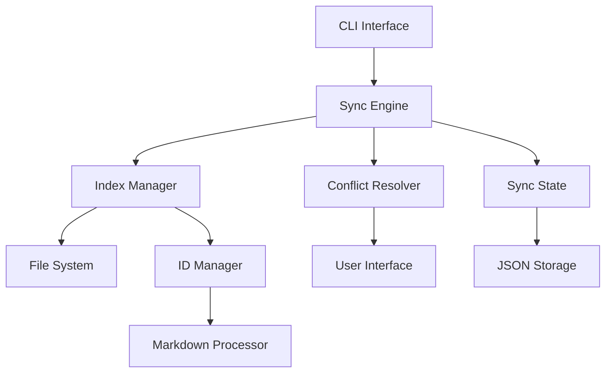

# Cast Sync - Technical Overview

## Executive Summary

Cast Sync is a decentralized, peer-to-peer synchronization system designed specifically for Markdown-based knowledge management vaults. It provides intelligent, conflict-aware synchronization between multiple vault instances without requiring a central server or cloud service.

## Core Concepts

### 1. Content-Addressable Storage

Cast uses UUID-based identifiers (cast-ids) to track files across vaults, making the system resilient to file renames and moves. Each file with cast metadata receives a unique, persistent identifier that follows it across all synchronized vaults.

### 2. Three-Way Merge Algorithm

The synchronization engine implements a three-way merge algorithm that compares:
- **Current State**: The current content in each vault
- **Base State**: The last synchronized version between vault pairs
- **Resolution**: Automatic or interactive conflict resolution based on change patterns

### 3. Body-Only Digest Comparison

To avoid unnecessary sync conflicts from metadata changes, Cast computes separate digests for:
- **Full Content**: Complete file including frontmatter
- **Body Only**: Content excluding frontmatter metadata

Synchronization decisions are based on body-only digests, allowing local metadata variations without triggering conflicts.

### 4. Atomic Operations

All file operations use atomic writes through temporary files and rename operations, ensuring:
- No partial file states
- Clean recovery from interruptions
- Data integrity guarantees
- Consistent vault state

## System Architecture

### Layered Design

```
┌─────────────────────────────────────────┐
│          User Interface Layer           │
│         (CLI Commands, Prompts)         │
├─────────────────────────────────────────┤
│         Business Logic Layer            │
│    (Sync Engine, Index, ID Manager)     │
├─────────────────────────────────────────┤
│          Data Access Layer              │
│    (Config, State, File Operations)     │
├─────────────────────────────────────────┤
│           Storage Layer                 │
│      (File System, JSON, YAML)          │
└─────────────────────────────────────────┘
```

### Component Interaction



## Key Algorithms

### 1. Incremental Indexing

```python
def incremental_index(vault_path):
    old_index = load_existing_index()
    new_files = discover_files(vault_path)
    
    for file in new_files:
        if file_changed_since(file, old_index):
            update_index_entry(file)
        else:
            keep_existing_entry(file)
    
    return updated_index
```

**Complexity**: O(n) where n = number of files
**Optimization**: Only reprocess changed files

### 2. Conflict Detection

```python
def detect_conflict(file_id, vault1, vault2, sync_state):
    digest1 = vault1.get_digest(file_id)
    digest2 = vault2.get_digest(file_id)
    base_digest = sync_state.get_base_digest(file_id)
    
    if digest1 == digest2:
        return NO_CONFLICT
    elif digest1 == base_digest:
        return USE_VAULT2  # Only vault2 changed
    elif digest2 == base_digest:
        return USE_VAULT1  # Only vault1 changed
    else:
        return CONFLICT  # Both changed
```

**Complexity**: O(1) per file
**Memory**: O(1) per comparison

### 3. Auto-Merge Logic

```python
def auto_merge(conflict_type, vault1_data, vault2_data):
    if conflict_type == ONE_SIDE_CHANGED:
        return use_changed_side()
    elif conflict_type == METADATA_ONLY:
        return use_content_side()
    elif conflict_type == IDENTICAL_CHANGES:
        return keep_current()
    else:
        return require_user_decision()
```

## Performance Characteristics

### Time Complexity

| Operation | Complexity | Typical Time |
|-----------|------------|--------------|
| Index Build | O(n) | 1-5 seconds for 10k files |
| Sync Check | O(n) | <1 second |
| Conflict Resolution | O(1) per file | Instant |
| File Transfer | O(file_size) | Network dependent |
| State Update | O(1) | Milliseconds |

### Space Complexity

| Component | Memory Usage | Disk Usage |
|-----------|--------------|------------|
| Index | O(n * metadata) | ~100 bytes/file |
| Sync State | O(n * vaults) | ~150 bytes/file/vault |
| Configuration | O(vaults) | <1 KB |
| Runtime | O(active_index) | Index size in memory |

### Scalability

- **File Count**: Tested with 50,000+ files
- **File Size**: Streaming for files >10MB
- **Vault Count**: O(n²) for all-pairs sync
- **Concurrent Operations**: File-level locking

## Data Integrity

### SHA-256 Hashing

All content verification uses SHA-256 cryptographic hashing:
- **Collision Resistance**: 2^256 possible values
- **Performance**: Hardware-accelerated on modern CPUs
- **Verification**: Every sync operation validates digests

### Atomic Write Pattern

```python
def atomic_write(path, content):
    temp_path = path.with_suffix('.tmp')
    
    # Write to temporary file
    with open(temp_path, 'w') as f:
        f.write(content)
    
    # Atomic rename (POSIX compliant)
    os.replace(temp_path, path)
```

### Recovery Mechanisms

1. **Incomplete Sync**: Resume from last known state
2. **Corrupted Index**: Rebuild from file system
3. **Missing Files**: Skip and report
4. **Invalid State**: Reset and rebuild

## Security Considerations

### Path Traversal Protection

```python
def safe_path(base, user_input):
    resolved = (base / user_input).resolve()
    if not resolved.is_relative_to(base):
        raise SecurityError("Path traversal attempt")
    return resolved
```

### Input Validation

- **UUID Format**: Strict regex validation
- **YAML Parsing**: Safe loader only
- **Path Resolution**: Canonical path checking
- **Command Injection**: No shell execution

### Data Privacy

- **Local Storage**: All data stored locally
- **No Telemetry**: No usage tracking
- **No Cloud**: No external services required
- **User Control**: Full data sovereignty

## Synchronization Protocol

### Phase 1: Discovery

1. Load global configuration
2. Identify all registered vaults
3. Verify vault availability
4. Load vault configurations

### Phase 2: Indexing

1. Build/update vault indices
2. Extract file metadata
3. Compute content digests
4. Auto-fix missing IDs

### Phase 3: Comparison

1. Load sync state history
2. Compare file sets
3. Identify differences
4. Classify change types

### Phase 4: Resolution

1. Apply auto-merge rules
2. Present conflicts to user
3. Execute user decisions
4. Handle skip requests

### Phase 5: Transfer

1. Create temporary files
2. Copy content atomically
3. Verify transfer integrity
4. Update file metadata

### Phase 6: Finalization

1. Update sync state
2. Save state to disk
3. Report results
4. Clean temporary files

## Extensibility Points

### 1. Sync Strategies

```python
class SyncStrategy(ABC):
    @abstractmethod
    def should_sync(self, file_a, file_b):
        pass
    
    @abstractmethod
    def resolve_conflict(self, file_a, file_b):
        pass
```

### 2. Storage Backends

```python
class StorageBackend(ABC):
    @abstractmethod
    def read(self, path):
        pass
    
    @abstractmethod
    def write(self, path, content):
        pass
```

### 3. Merge Algorithms

```python
class MergeAlgorithm(ABC):
    @abstractmethod
    def can_auto_merge(self, base, current, other):
        pass
    
    @abstractmethod
    def merge(self, base, current, other):
        pass
```

## Performance Optimization

### 1. Lazy Loading

Configuration and indices are loaded only when needed:

```python
@cached_property
def index(self):
    return Index.load(self.vault_path)
```

### 2. Incremental Processing

Only changed files are reprocessed during indexing:

```python
if file.stat().st_mtime <= last_index_time:
    continue  # Skip unchanged file
```

### 3. Parallel Operations

Multiple vaults can be indexed concurrently:

```python
with ThreadPoolExecutor() as executor:
    futures = [executor.submit(index_vault, v) for v in vaults]
    results = [f.result() for f in futures]
```

### 4. Memory Streaming

Large files are processed in chunks:

```python
def compute_digest_streaming(file_path):
    hasher = hashlib.sha256()
    with open(file_path, 'rb') as f:
        for chunk in iter(lambda: f.read(4096), b''):
            hasher.update(chunk)
    return hasher.hexdigest()
```

## Testing Strategy

### Unit Testing

- Individual function validation
- Edge case coverage
- Error condition handling
- Mock file system operations

### Integration Testing

- Multi-vault synchronization
- Conflict resolution scenarios
- Recovery from failures
- Performance benchmarks

### System Testing

- Real-world vault structures
- Large file sets
- Network interruptions
- Concurrent operations

## Deployment Considerations

### System Requirements

- **Python**: 3.8 or higher
- **Memory**: 100MB + index size
- **Disk**: Vault size + 10% overhead
- **OS**: Windows, macOS, Linux

### Installation Methods

1. **pip**: `pip install cast-sync`
2. **uv**: `uv tool install cast-sync`
3. **pipx**: `pipx install cast-sync`
4. **Source**: `pip install -e .`

### Configuration Management

- **Global Config**: User-specific settings
- **Vault Config**: Per-vault settings
- **Environment Variables**: Override options
- **Command Arguments**: Runtime overrides

## Monitoring and Diagnostics

### Logging Levels

- **ERROR**: Critical failures
- **WARNING**: Potential issues
- **INFO**: Normal operations
- **DEBUG**: Detailed diagnostics

### Performance Metrics

- Index build time
- Sync operation duration
- Conflict resolution rate
- File transfer speed

### Health Checks

- Configuration validity
- Index consistency
- Sync state integrity
- File system permissions

## Future Enhancements

### Planned Features

1. **Differential Sync**: Only transfer changed portions
2. **Compression**: Reduce transfer size
3. **Encryption**: End-to-end encryption option
4. **Remote Storage**: S3/WebDAV backends
5. **Real-time Sync**: File system watchers

### Architecture Evolution

1. **Plugin System**: Dynamic loading of extensions
2. **API Server**: RESTful API for integrations
3. **GUI Frontend**: Graphical interface option
4. **Mobile Support**: iOS/Android clients
5. **Collaboration**: Multi-user conflict resolution

## Conclusion

Cast Sync provides a robust, efficient, and user-friendly solution for synchronizing Markdown vaults across multiple locations. Its decentralized architecture, intelligent conflict resolution, and focus on data integrity make it ideal for personal knowledge management, team documentation, and distributed content systems.

The modular design and clear extension points ensure the system can evolve to meet future requirements while maintaining backward compatibility and data safety.